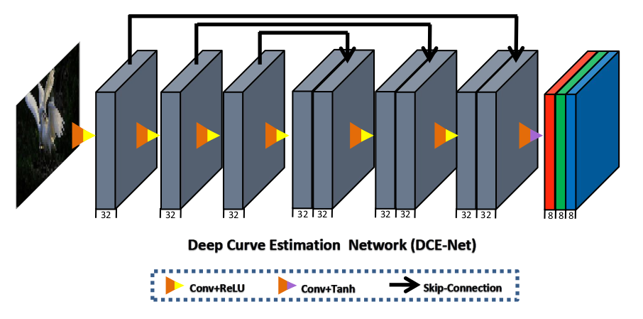

# Zero-DCE: Low-Light Image Enhancement

This repository contains an **implementation of Zero-DCE** (Zero-Reference Deep Curve Estimation) for low-light image enhancement using **PyTorch**. Zero-DCE formulates light enhancement as an image-specific curve estimation task, where a set of enhanced images is iteratively refined through a differentiable curve function. The model was trained on the Low-Light Dataset (LOL) which can be found [here](https://www.kaggle.com/datasets/soumikrakshit/lol-dataset)

## Architecture

Zero-DCE is a lightweight, self-supervised model for low-light image enhancement. Instead of relying on paired data, it formulates enhancement as a curve estimation problem, where an iterative adjustment curve is learned to progressively refine the input image.
- The model consists of a lightweight deep neural network that predicts a set of pixel-wise adjustment curves (A).
- These curves are then iteratively applied to the input image, enhancing its brightness and contrast in a content-aware manner.
- The network is fully convolutional, using ReLU activations to ensure non-negativity and small kernel sizes to capture local dependencies.
- The final output is obtained by progressively modifying pixel values over multiple iterations, mimicking an adaptive exposure adjustment process.
This approach allows Zero-DCE to enhance images without ground truth supervision.

## Sample Results

Below are sample results showcasing the enhancement produced by the model.

---

## Future Work

- Fine-tuning a pre-trained model such as MirNetV2
- Using diverse datasets like See-in-the-Dark (SID) by Sony.
